# CodeMentor

CodeMentor is a local programming assistant built on **Qwen2.5-Coder-1.5B-Instruct** and adapted with QLoRA for concise, task-focused code generation. It provides a professional Flask interface for asking programming questions, retaining context within the current browser session, and comparing the baseline model with the active fine-tuned adapter.

The complete workflow runs locally. Hugging Face is used to obtain the source dataset and base-model files, which are then cached on disk; the application does not use a paid inference API.

## Project Overview

This project evaluates whether a carefully filtered subset of CodeAlpaca can improve a compact code model on common programming tasks while remaining practical on a 4 GB laptop GPU.

The final solution combines:

- a deterministic dataset-auditing and split pipeline;
- a stricter local syntax/compile screening stage for V2 training;
- 4-bit Qwen model loading with LoRA adapters;
- completion-only supervised fine-tuning;
- deterministic baseline-versus-adapter evaluation; and
- a Flask workbench with session-scoped conversations and instant model switching.

The active V2 adapter produced the best aggregate score in the project's 11-question development regression evaluation: **78/88 (88.64%)**, compared with **74/88 (84.09%)** for baseline Qwen and **70/88 (79.55%)** for the previous adapter.

> The 11 questions were used to select V2, so these results are development evidence rather than an unbiased final benchmark. The curated examples are structurally and syntactically screened, but semantic correctness is not guaranteed.

## Features

- Fully local inference after model artifacts have been downloaded.
- Baseline Qwen and fine-tuned V2 comparison from one interface.
- Fast switching by enabling or disabling LoRA on one loaded base model.
- Automatic conversation reset when the selected model changes.
- In-memory multi-turn context for the current application session.
- Token-aware history trimming within the 512-token sequence budget.
- Loading, ready, unavailable, busy, and retry states in the UI.
- Deterministic generation with `do_sample=False`.
- Conservative dataset validation without executing dataset programs.
- Reproducible selection and splitting with seed `3407`.
- V1 adapter backup for immediate rollback.
- Automated tests for the API, conversation store, runtime, frontend contract, curation, and training configuration.

## Architecture

```mermaid
flowchart LR
    subgraph Offline[Offline data and training pipeline]
        HF[Hugging Face Hub<br/>CodeAlpaca + Qwen] --> Cache[Local Hugging Face cache]
        Cache --> Raw[data/raw/codealpaca.json<br/>20,022 examples]
        Raw --> Audit[Structural audit<br/>schema, length, relevance,<br/>duplicates, conflicts]
        Audit --> Split[Group-isolated split<br/>seed 3407]
        Split --> Train6K[6,000 train]
        Split --> Val500[500 validation]
        Split --> Test500[500 test]
        Train6K --> Verify[Local syntax/compile screening<br/>deduplication + leakage checks]
        Val500 --> Verify
        Test500 -. prompt fingerprints .-> Verify
        Verify --> V2Data[1,000 V2 train<br/>100 V2 validation]
        V2Data --> QLoRA[4-bit Qwen + QLoRA<br/>completion-only SFT]
        QLoRA --> Adapter[models/adapter<br/>active V2 LoRA weights]
    end

    subgraph Online[Online Flask inference pipeline]
        Browser[Browser UI<br/>HTML + CSS + JavaScript] --> API[Flask JSON API]
        API --> Runtime[ModelRuntime<br/>loading state + GPU lock]
        Runtime --> Context[ConversationStore<br/>session memory + token trimming]
        Context --> Model[One 4-bit Qwen instance]
        Adapter --> Model
        Model -->|LoRA enabled| FineTuned[Fine-tuned response]
        Model -->|LoRA disabled| Baseline[Baseline response]
        FineTuned --> Browser
        Baseline --> Browser
    end
```



### Layer 1: Data acquisition

`src/data_preparation.py` loads `flwrlabs/code-alpaca-20k` through the Hugging Face `datasets` library. Hugging Face downloads the dataset on the first run and reuses its local cache on later runs. The repository also keeps the complete 20,022-example source snapshot at `data/raw/codealpaca.json` for traceability.

### Layer 2: Audit, filtering, and splitting

`src/curation.py`, `src/selection.py`, and `src/select_splits.py` perform schema checks, relevance and length checks, duplicate/conflict grouping, limited factual checks, language-aware ranking, deterministic selection, and group-isolated splitting. The general curated dataset contains 6,000 training, 500 validation, and 500 test examples.

`src/verified_curation.py` applies a stricter second pass for V2. It rejects unsupported or malformed answers and locally parses or compiles supported languages without running the submitted programs. Prompt fingerprints prevent overlap between the V2 training set and the existing validation/test prompts.

### Layer 3: Model training

`src/train.py` loads Qwen in 4-bit mode through Unsloth, attaches LoRA matrices to attention and MLP projection layers, formats each record as a Qwen chat prompt/completion pair, and trains only on assistant completion tokens. Only the small adapter parameters are updated; the quantized base weights remain frozen.

### Layer 4: Model runtime

`app/model_runtime.py` loads the active adapter asynchronously so Flask can display the interface while initialization is in progress. A GPU lock serializes generation requests. Baseline mode temporarily disables LoRA; fine-tuned mode enables it. This avoids loading two full model copies into the 4 GB GPU.

### Layer 5: Conversation management

`app/conversations.py` stores turns in memory by session ID. It uses the tokenizer's Qwen chat template to measure input length and removes the oldest complete turns when necessary. Conversations are intentionally not written to disk: reloading or closing the application starts a new session, and switching models clears all current context.

### Layer 6: Presentation and API

`app/app.py` exposes the page and JSON endpoints for model status, retry, model selection, chat, and session clearing. `app/templates/index.html`, `app/static/styles.css`, and `app/static/app.js` implement the browser workbench and communicate with Flask using `fetch`.

## Dataset Preparation and Split Methodology

### Stage 1: 20,022 source records to 7,000 curated records

The original CodeAlpaca records are processed locally. No dataset answer is executed.

1. Validate the `instruction`, `input`, and `output` schema.
2. Reject empty, damaged, overly long, non-programming, placeholder, or incomplete records.
3. Apply Python parsing and narrow deterministic checks where supported.
4. Detect exact duplicates, conflicting answers, reused outputs, and prompt groups with lexical Jaccard similarity of at least `0.85`.
5. Retain recognized programming languages and rank eligible examples deterministically.
6. Apply a maximum 50% share for any one language.
7. Select 7,000 records and split whole similarity groups with random seed `3407`.

| General split | Examples | Purpose |
|---|---:|---|
| Training | 6,000 | Model-development pool |
| Validation | 500 | Development and validation pool |
| Test | 500 | Held-out evaluation pool |
| **Total** | **7,000** | |

Keeping an entire duplicate/similarity group in one partition reduces obvious leakage between training, validation, and test data. The grouping is lexical and heuristic, so it cannot prove that every semantic paraphrase is isolated.

### Stage 2: V2 syntax/compile-screened subset

V2 uses a more conservative subset rather than all 6,000 training examples:

- normalize and hash each instruction/input prompt;
- exclude prompt hashes found in validation or test data;
- remove duplicate prompts;
- require a code-generation action in the instruction;
- reject empty, very short, oversized, placeholder, unbalanced, or incomplete outputs;
- parse Python with the AST/compiler;
- invoke locally available syntax or compile checks for JavaScript, Java, Bash, Go, and C#;
- select deterministically with seed `3407`; and
- cap a single language at 50% when multiple languages are available.

| V2 split | Examples | Language distribution |
|---|---:|---|
| Training | 1,000 | Python 500, JavaScript 388, Java 111, Go 1 |
| Validation | 100 | Filtered from the original validation partition |

The V2 filter found 3,240 acceptable candidates inside the 6,000-example training pool and selected 1,000. Syntax or compilation success is not proof that the solution implements the requested behavior; this limitation is preserved in the evaluation report and manifest.

Detailed filter documentation is available in [DATASET_CURATION_FILTERS.md](DATASET_CURATION_FILTERS.md).

## Training Configuration

| Setting | Value |
|---|---|
| Base model | `Qwen/Qwen2.5-Coder-1.5B-Instruct` |
| Runtime base artifact | `unsloth/qwen2.5-coder-1.5b-instruct-bnb-4bit` |
| Method | QLoRA supervised fine-tuning |
| Quantization | 4-bit base-model loading |
| Maximum sequence length | 512 tokens |
| Training examples | 1,000 |
| Validation examples | 100 |
| Epochs | 2 |
| Optimizer steps | 250 |
| Per-device batch size | 2 |
| Gradient accumulation | 4 |
| Effective batch size | 8 |
| Learning rate | `5e-5` |
| Optimizer | `adamw_8bit` |
| Precision | BF16 |
| LoRA rank / alpha | 16 / 16 |
| LoRA dropout | 0 |
| Target modules | `q_proj`, `k_proj`, `v_proj`, `o_proj`, `gate_proj`, `up_proj`, `down_proj` |
| Gradient checkpointing | Unsloth |
| Training objective | Completion-only loss |
| Evaluation/save interval | Every 50 steps |
| Best-model metric | Lowest validation loss |
| Seed | 42 for training; 3407 for dataset selection |
| Best/final validation loss | `0.3921625912` |

Completion-only loss masks user-prompt tokens and optimizes the assistant response. This better matches the intended behavior than teaching the model to reproduce both sides of the conversation.

## Evaluation Methodology

Baseline Qwen, adapter V1, and adapter V2 were evaluated on the same 11 programming prompts. Each prompt was generated independently using deterministic decoding:

- `do_sample=False`;
- maximum 256 new tokens for the recorded comparison;
- no conversation history carried between prompts; and
- the same base model and prompt format for baseline and adapter modes.

Each response received a score from 0 to 2 on four dimensions:

| Criterion | 0 | 1 | 2 |
|---|---|---|---|
| Correctness | Wrong | Partially correct | Correct |
| Relevance | Does not answer | Mostly relevant | Directly relevant |
| Completeness | Major parts missing | Some parts missing | Complete |
| Code validity | Does not work | Minor fix required | Works |

With four criteria across 11 questions, the maximum score is 88.

## Final Solution and Metrics

| Model | Correctness | Relevance | Completeness | Code validity | Total | Percentage |
|---|---:|---:|---:|---:|---:|---:|
| Baseline Qwen | 18/22 | 22/22 | 18/22 | 16/22 | 74/88 | 84.09% |
| Previous adapter V1 | 15/22 | 22/22 | 18/22 | 15/22 | 70/88 | 79.55% |
| **Fine-tuned adapter V2** | **18/22** | **22/22** | **19/22** | **19/22** | **78/88** | **88.64%** |

V2 improved by **4 points, or 4.55 percentage points, over baseline Qwen** and by **8 points, or 9.09 percentage points, over V1**. V2 tied baseline correctness, retained full relevance, and improved aggregate completeness and code validity.

The active adapter is stored at `models/adapter`. The previous adapter is preserved at `models/adapter_v1_backup`. Artifact hashes, exact settings, and provenance are recorded in [results/adapter-v2-manifest.json](results/adapter-v2-manifest.json).

### Interpretation

The project goal was achieved on the recorded development regression sample: V2 outperformed both the unmodified baseline and the previous fine-tuned adapter. It is not yet valid to claim universal superiority because:

- the evaluation contains only 11 questions;
- those questions influenced the promotion decision;
- mechanical dataset validation cannot guarantee semantic correctness; and
- V2 training is concentrated in Python, JavaScript, and Java.

A future final benchmark should use fresh unseen prompts and broader language coverage.

## Baseline vs. Fine-Tuned Examples

The excerpts below are real generated outputs from the project reports; they were not written as replacement answers.

### Example 1: Java class

**Prompt:** How would you create a class in Java and add a field, constructor and method?

**Baseline:** Correct but verbose, including IDE instructions before the code.

```java
public class Person {
    private String name;
    private int age;

    public Person(String name, int age) {
        this.name = name;
        this.age = age;
    }

    public void introduce() {
        System.out.println("Hello, my name is " + name);
    }
}
```

**Fine-tuned V2:** Correct and more direct.

```java
public class MyClass {
    private int myField;

    public MyClass(int myField) {
        this.myField = myField;
    }

    public void myMethod() {
        System.out.println("My Method");
    }
}
```

Both responses were correct; V2 answered with less unrelated setup text.

### Example 2: Bash unique three-letter string

**Prompt:** Create a bash script that generates a random 3 letter string with no duplicates in it.

The baseline pipeline used `echo {a..z} | fold -w1 | shuf | head -n 3`, which could admit spaces and did not guarantee exactly three letters. V2 generated characters individually and rejected any character already present:

```bash
result=""
while [ ${#result} -lt 3 ]; do
    letter=${letters[$((RANDOM % ${#letters[@]}))]}
    if [[ ! $result == *$letter* ]]; then
        result+=$letter
    fi
done
echo "$result"
```

Baseline received 6/8 for this task; V2 received 8/8.

The complete response-level analysis is in [results/finetuned_vs_baseline.md](results/finetuned_vs_baseline.md).

## Technology Stack

| Area | Technology |
|---|---|
| Base model | Qwen2.5-Coder-1.5B-Instruct |
| Model distribution/cache | Hugging Face Hub and `datasets` |
| Fine-tuning acceleration | Unsloth |
| Training | PyTorch, Transformers, TRL, PEFT/LoRA |
| Memory reduction | 4-bit quantization, 8-bit optimizer, gradient checkpointing |
| Backend | Python and Flask |
| Frontend | HTML, CSS, vanilla JavaScript |
| Data processing | Python, JSON, hashing, local compilers/parsers |
| Testing | pytest and Python `compileall` |

The successful training environment reported PyTorch `2.11.0+cu128`, CUDA Toolkit `12.8`, Transformers `5.5.0`, TRL `0.24.0`, PEFT `0.21.0`, Unsloth `2026.9.6`, Triton `3.8.0`, and xFormers `0.0.35`.

## Hardware and System Requirements

### Tested system

- Windows with PowerShell
- Python 3.12 virtual environment
- NVIDIA GeForce RTX 3050 Laptop GPU
- 4 GB GPU memory
- CUDA compute capability 8.6
- CUDA-enabled PyTorch

### Practical requirements

- An NVIDIA CUDA-capable GPU is required by the current application runtime.
- Approximately 4 GB of VRAM is sufficient for the tested 1.5B 4-bit model configuration, although free memory is sensitive to other GPU applications.
- Allow additional disk space for the Hugging Face cache, raw dataset, base model, checkpoints, and adapter backups.
- Windows Developer Mode or administrator privileges are optional but remove Hugging Face's symlink-cache warning and can reduce duplicate cache usage.
- Internet access is required for the first base-model/dataset download; cached artifacts support later local use.

CPU-only inference is not implemented in the current runtime. If CUDA, GPU memory, or the adapter is unavailable, Flask remains open and the UI reports the corresponding state.

## Installation

From the project root:

```powershell
python -m venv .venv
.\.venv\Scripts\Activate.ps1
pip install -r requirements.txt
```

`requirements.txt` contains the lightweight Flask and test dependencies. Training and GPU inference additionally require compatible installations of PyTorch with CUDA, Unsloth, Transformers, Datasets, TRL, PEFT, bitsandbytes, Triton, and xFormers. Their versions must be selected together for the installed CUDA/Python environment.

## Running the Application

Activate the virtual environment and start Flask from the repository root:

```powershell
.\.venv\Scripts\Activate.ps1
python -m app.app
```

Then open `http://127.0.0.1:5000`.

The page opens while the model loads in a background thread:

- **Loading:** adapter and tokenizer initialization is in progress.
- **Ready:** chat and model selection are enabled.
- **Unavailable:** CUDA, GPU memory, model files, or adapter files are unavailable.

The model dropdown does not load a second base model. Fine-tuned mode enables V2 LoRA; baseline mode temporarily disables the adapter. Switching modes resets conversation state to keep comparisons independent.

## Rebuilding the V2 Dataset

The original 6,000/500/500 split must already exist. Then run:

```powershell
python src/verified_curation.py
```

This writes:

- `data/processed/verified_dataset.json` — 1,000 V2 training and 100 validation examples;
- `results/verified-curation/report.json` — selection counts, available validators, languages, and rejection reasons.

The outcome depends on which local validators are installed. The recorded V2 dataset is fingerprinted in the provenance manifest.

## Training

Train a candidate without overwriting the active adapter:

```powershell
python src/train.py --train-file data/processed/verified_dataset.json --output-dir models/adapter_candidate
```

Review the candidate before replacing `models/adapter`; keep the current adapter as a rollback copy.

## Testing

```powershell
.\.venv\Scripts\python.exe -m pytest tests -q
.\.venv\Scripts\python.exe -m compileall app src tests
```

The last verified test run completed with **74 passed and 2 skipped**. Model lifecycle and API tests use local fakes, so the test suite does not need to allocate the GPU model.

## Repository Structure

```text
CodeMentor/
├── app/
│   ├── app.py                 # Flask routes and application factory
│   ├── model_runtime.py       # GPU model lifecycle and generation
│   ├── conversations.py      # Session-scoped token-aware history
│   ├── templates/index.html  # Workbench markup
│   └── static/                # CSS and browser JavaScript
├── data/
│   ├── raw/codealpaca.json
│   ├── processed/dataset.json
│   ├── processed/verified_dataset.json
│   └── test/test.json
├── models/
│   ├── adapter/               # Active V2 adapter
│   └── adapter_v1_backup/     # Previous adapter rollback
├── results/
│   ├── finetuned_vs_baseline.md
│   ├── adapter-v2-manifest.json
│   └── verified-curation/report.json
├── src/
│   ├── data_preparation.py
│   ├── curation.py
│   ├── select_splits.py
│   ├── verified_curation.py
│   ├── train.py
│   ├── inference.py
│   └── evaluate.py
├── tests/
├── DATASET_CURATION_FILTERS.md
├── requirements.txt
└── README.md
```

## Reproducibility and Limitations

- The active V2 and rollback V1 adapter hashes are recorded in `results/adapter-v2-manifest.json`.
- The dataset, training scripts, generated responses, evaluation report, and adapter weights are tied together with SHA-256 hashes.
- The raw data and model are downloaded from Hugging Face but inference is performed locally.
- Dataset programs are parsed or compiled where possible; they are never executed by the filtering pipeline.
- Compiler success does not establish algorithmic correctness, edge-case handling, dependency availability, or instruction compliance.
- The V2 dataset is not balanced across every target language.
- The recorded 11-prompt scores are useful for regression tracking but must not be presented as an independent final benchmark.

For the detailed evaluation, generated answers, per-question scores, and known errors, see [results/finetuned_vs_baseline.md](results/finetuned_vs_baseline.md).
